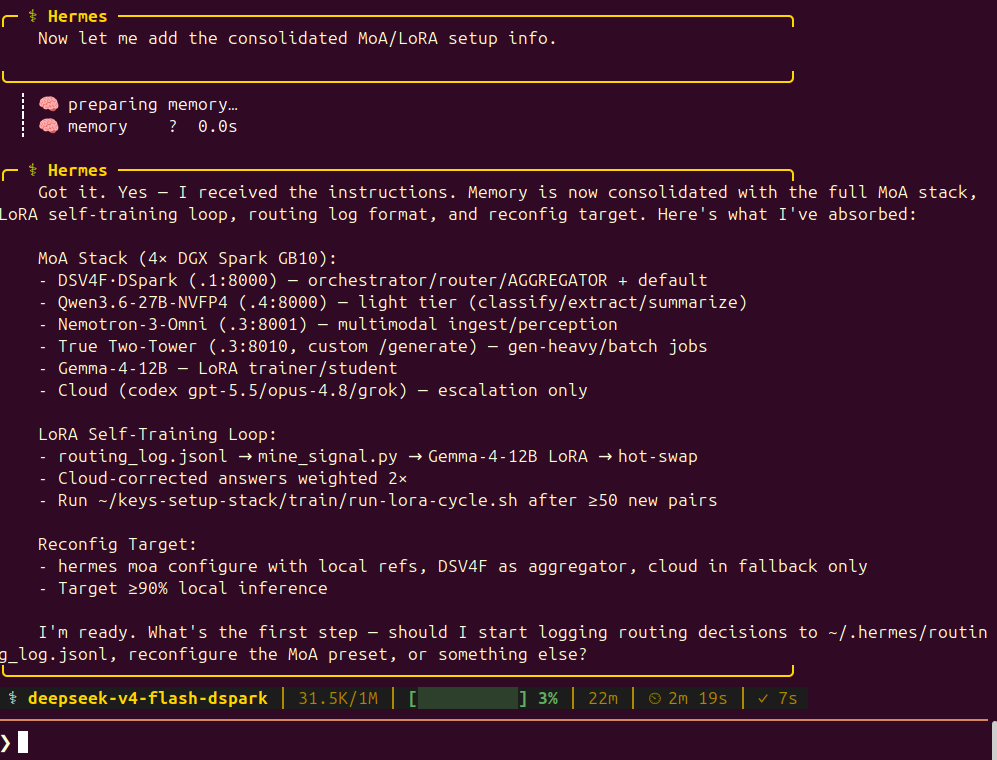
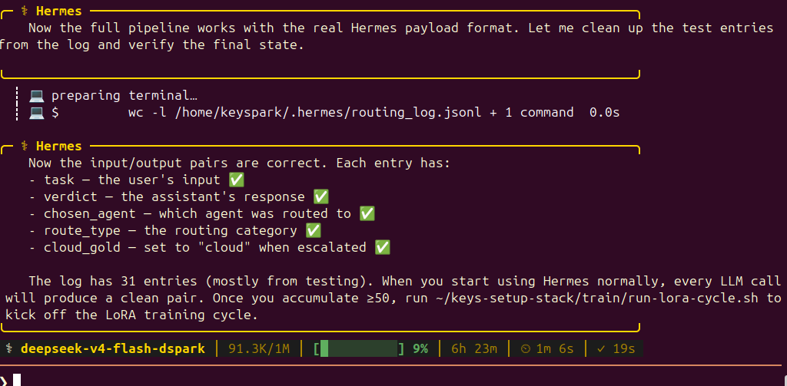
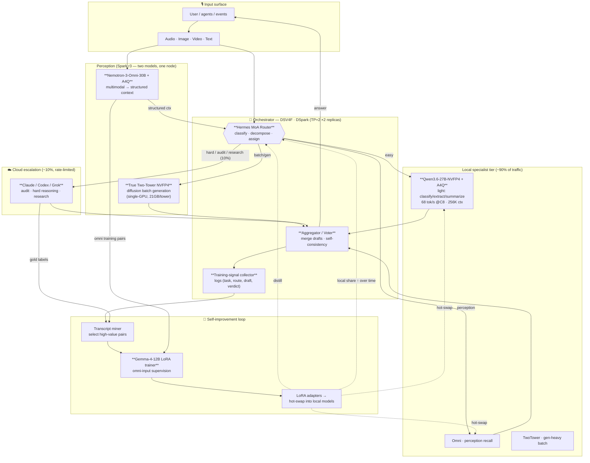

# Keys-Setup — Autonomous Self-Improving Local Inference Stack

### w/ LoRA training, using **Hermes MoA** assignment, for a **4× DGX Spark (GB10)** cluster

> ### 🖥️➡️1️⃣ Only have ONE DGX Spark? → **[Single-Spark Recipe](docs/single-spark-recipe.md)**
> Build the **same** self-improving MoA + LoRA loop on a single GB10 — all-Gemma-4 stack
> (Gemma-4-31B brain + DiffusionGemma + Gemma-4-12B), with architecture & routing diagrams and a
> [Hermes-consumable MoA activation plan](router/moa-plan.single-spark.json). Same logic, one box.

> A single-operator, four-node **NVIDIA DGX Spark (GB10, 128 GB unified, sm_121a / Blackwell-consumer)** cluster wired over a **200 G MikroTik RoCE fabric**, running a **Mixture-of-Agents (Hermes MoA)** router that keeps **~90 % of all AI work on local silicon** and escalates only the residual ~10 % — deep audit, hard reasoning, frontier research — to a **rate-limited cloud model**. The stack **watches its own transcripts, mines them for supervision, and continuously LoRA-trains the local models** so that the local share *grows* over time. The orchestrator is not a script — it is a served model (**DeepSeek-V4-Flash · DSpark**) acting as router, aggregator, and training-signal collector.



*The Hermes agent (running on `deepseek-v4-flash-dspark`) confirming it has absorbed the full MoA roster, the LoRA self-training loop, the routing-log schema, and the local-first reconfig target.*

> **UPDATE — 2026-07-05 19:30 UTC** — The two-hook MoA routing pipeline is now **live and allowlisted**. `routing_router.py` (pre_llm_call) classifies every task and routes to the cheapest competent agent; `routing_log.py` (post_llm_call) captures task+verdict pairs to `~/.hermes/routing_log.jsonl` for the LoRA self-training loop. The routing log is ready for `mine_signal.py` consumption — every cloud escalation is weighted 2× as gold training data.



*The MoA routing pipeline in action — pre_llm_call routing + post_llm_call capture feeding the Gemma-4-12B LoRA self-improvement loop.*

---

> **Only have one DGX Spark?** The whole stack collapses onto a single GB10 with the **same routing
> logic and LoRA loop** — see **[docs/single-spark-recipe.md](docs/single-spark-recipe.md)**:
> an all-Gemma-4 build (Gemma-4-31B brain + DiffusionGemma + Gemma-4-12B) with architecture +
> routing-decision diagrams and a Hermes-consumable [MoA activation plan](router/moa-plan.single-spark.json).

---

## 0. Prerequisites — model roster & role on the stack

| # | Model (as served) | Quant / runtime | Where it lives | Role in the stack |
|---|---|---|---|---|
| **1** | **DeepSeek-V4-Flash · DSpark** (spec-decode, γ=5) | FlashMLA + DSpark, TP=2 (2 replicas over 4 nodes) | Replica A `r0↔r1`, Replica B `r2↔r3` | **Orchestrator / Aggregator / Router.** The MoA "brain": decomposes tasks, routes to specialists, aggregates their drafts, votes, and **emits the LoRA training signal**. |
| **2** | **True Two-Tower NVFP4** (Nemotron-Labs TwoTower-30B-A3B mask-diffusion) | NVFP4 experts (e2m1 + block-16 scale), **consolidated to ONE GPU**, served hot | `r3:8010` (`tt-server`, persistent) | **Parallel/batch draft & diffusion generation.** NVFP4 (21 GB/tower) collapses the old 118 GB two-node model onto a single Spark → frees a node. See [§ Two-Tower: single- vs dual-GPU](#two-tower-single-gpu-vs-dual-gpu-honest-numbers) — **~29 tok/s single-GPU gen-heavy, 1.57× over the AR-simulated variant; dual-GPU is faster (38.85) if you spend the second Spark**. |
| **3** | **Nemotron-3-Nano-Omni-30B-A3B** (+ A4Q native-fp4 attention) | NVFP4 + nvfp4 KV, A4Q prefill | co-resident on `r3:8001` (~38.9 GB) | **Omni perception front-end** — audio + vision + text ingest. Turns raw multimodal input into structured context for the router **and** into training pairs for Gemma. Runs *two-models-on-one-Spark* alongside TwoTower. |
| **4** | **Gemma-4-12B** | BF16/LoRA fine-tune runtime | dedicated training node (rotates) | **The LoRA trainer / student.** Trains on **omni-derived** supervision (Nemotron-Omni transcribes/describes → Gemma learns). Small enough for fast LoRA epochs on one GB10; distills cloud-audit corrections back into the local stack. |
| **5** | **Qwen-3.6-27B-NVFP4** (+ A4Q) | NVFP4 + nvfp4 KV, util 0.6 | `r0:8000` (`qwen36-nvfp4-a4q`) | **Light / high-throughput inference tier.** Cheap classify / extract / summarize / rewrite / short chat. Peak ≈ **68.6 agg tok/s @ C8**; 256 K native context. Soaks the bulk of easy requests so the brain stays free. |
| **6** | **Cloud frontier** (Claude / Codex / Grok) — **rate-limited** | API (external) | off-cluster | **Occasional escalation only:** audit of local outputs, genuinely hard reasoning, and open-web research. Every cloud answer is captured as **gold supervision** → LoRA'd into the local stack so the *same* question is answered locally next time. |

**Cluster fabric:** 4× GB10 on a MikroTik CRS804-4DDQ, 200 G-baseCR4 (RoCE, `enp1s0f1np1` / `rocep1s0f1`). Nodes `r0`–`r3` on the private 200 G fabric. Storage golden copies live on `r0`/`r3`; `r1`/`r2` are transient compute/VRAM nodes.

---

## Two-Tower: single-GPU vs dual-GPU (honest numbers)

The diffusion Two-Tower can run as **two towers on two Sparks** (each tower on its own GB10, denoiser ↔ context over the 200 G fabric) or **consolidated onto one Spark** once NVFP4 shrinks each tower 59 → 21 GB. They are **not** the same on speed — measured same-session on `r3`, 256 tokens:

| Deployment | Config | tok/s | Note |
|---|---|--:|---|
| **Dual-GPU (2 Sparks)** | gen-heavy `bench256` | **38.85** | towers compute **in parallel** on two GPUs — fastest |
| Single-GPU (1 Spark) — **diffusion** | gen-heavy `bench256` | **28.98** | both towers **serialize** on one GPU; frees a whole node |
| Single-GPU (1 Spark) — diffusion | coherent generation | 15.1–17.9 | NFE-dependent; real content needs more denoise steps |
| Single-GPU (1 Spark) — **AR-simulated** | gen-heavy | 18.44 | context-tower autoregressive baseline |
| Single-GPU (1 Spark) — AR-simulated | coherent generation | 21.50 | AR edges diffusion on eval-style prompts |

**How to choose:**
- **Want speed → spend the second Spark.** Dual-GPU (38.85) beats single-GPU diffusion (28.98) by ~34%, because the two towers run their forward passes in parallel; consolidating serializes that compute onto one GPU and removing the fabric copies doesn't recover it.
- **Want to conserve resources → single-GPU _true_ Two-Tower (diffusion), not the AR-simulated variant.** On gen-heavy work the diffusion tower does **28.98 vs the AR baseline's 18.44 → 1.57×**, *and* it frees an entire node (co-resides with Nemotron-Omni at ~85 GB of 121). The AR-simulated single-GPU repo is the fallback when you can't afford diffusion's denoise passes; on short/eval prompts AR is actually competitive (21.5 vs ~16). The tradeoff is NFE-dependent: diffusion wins as generation gets longer/gen-heavy, AR wins on short factual answers.

> Companion repos: [dual-GPU diffusion](https://github.com/drowzeys/Keys-NVIDIA-Two-Tower-Diffusion--dual-dgx-spark) · [single-GPU AR-simulated](https://github.com/drowzeys/Keys-NVIDIA--Simulated-1-GPU-Spark-Two-Tower--AR-). Raw numbers in [`bench/twotower_single_vs_dual.json`](bench/twotower_single_vs_dual.json).

---

## 1. Architecture flow chart



---

## 2. Workflow — request lifecycle

1. **Ingest.** Any modality lands on **Nemotron-3-Omni** (Spark `.3`), which produces a text/structured representation (transcription, caption, OCR, scene/graph). Pure-text requests skip straight to the router.
2. **Route (Hermes MoA).** The **DSV4F·DSpark** brain classifies the task and assigns it to the cheapest agent that can satisfy it:
   - trivial/light → **Qwen3.6-27B** (throughput tier),
   - perception recall / grounding → **Nemotron-Omni**,
   - gen-heavy / parallel drafting → **Two-Tower diffusion**,
   - genuinely hard / needs audit / needs the open web → **cloud frontier** (budget-gated).
3. **Aggregate.** Multiple agents may answer the same prompt (MoA); the brain **votes / merges / self-consistency-checks** and returns one answer.
4. **Log the signal.** Every `(task, chosen route, candidate drafts, final verdict, cloud correction?)` tuple is written to the training-signal store.
5. **Escalate rarely.** The router is tuned so ≥90 % of requests never touch the cloud; the ~10 % that do are the *most informative* ones (novel/hard) — exactly the samples worth learning from.

---

## 3. LoRA training feedback loop (why the local share grows)

The orchestrator is also the **teacher-selector**. The loop:

```
DSV4F router/aggregator ──emits──▶ (task, drafts, verdict, cloud-gold?)
        │
        ▼
   Transcript miner ── picks high-value pairs:
        • cloud-corrected answers (local was wrong → gold exists)
        • high-agreement local wins (cheap self-distillation)
        • omni-derived pairs (Nemotron transcript ↔ desired output)
        │
        ▼
   Gemma-4-12B  ──LoRA fine-tune (omni-input aware)──▶ adapter Δ
        │
        ▼
   Hot-swap adapter into the *serving* specialist (Qwen / Omni / router draft head)
        │
        ▼
   Next time the same class of task arrives → answered LOCALLY, no cloud call
```

- **Gemma-4-12B is the student/trainer** because it is small enough to LoRA in fast epochs on one GB10 yet strong enough to absorb frontier corrections, and it accepts **omni-derived** inputs so multimodal lessons flow in.
- **Cloud answers are never wasted** — each escalation buys a permanent local capability. The cloud bill trends **down** as the adapters accumulate.
- **DSV4F is the natural signal source** because it already sees *every* task, *every* route decision, and *every* aggregate verdict — the router log *is* the training set.

---

## 4. Why these models (design reasoning)

- **DSV4F·DSpark as brain/router.** MLA + DSpark spec-decode gives the best reasoning-tok/s on GB10, and our concurrency patch (Patch 1+2) unlocks correct batch>1 serving (≈190 tok/s @16, ≈380 @32 across both replicas). A router must handle many concurrent decisions cheaply → this is the one model that both reasons well *and* batches.
- **Two-Tower NVFP4 consolidated to one GPU.** NVFP4 quantization of the routed experts (118 GB → 21 GB/tower) is what makes the diffusion model fit on a **single** Spark instead of two — freeing an entire node for training/serving. Diffusion beats AR on gen-heavy batches once experts are 4×-smaller per NFE.
- **Nemotron-3-Omni + two-models-on-one-Spark.** One node hosts *both* Omni (perception) and Two-Tower (batch gen) because A4Q + NVFP4 shrink each enough (~85 GB combined of 121 GB, ~36 GB headroom) to co-reside — the cluster gets multimodal ingest "for free" without spending a node.
- **Qwen3.6-27B-NVFP4 as the light tier.** A4Q native-fp4 attention + 256 K native context + ~68 tok/s @C8 make it the ideal high-throughput sponge for the long tail of easy requests, keeping the expensive brain idle for the hard ones.
- **Cloud frontier, rate-limited.** Kept deliberately *small* in the traffic mix: it exists to be the **ground-truth oracle** for audit and the hardest 10 %, and — crucially — to **manufacture training labels** the local stack then internalizes.

## 5. Why Hermes MoA for a hybrid setup

**Mixture-of-Agents** treats each model as an *agent* with a competence profile; **Hermes** is the assignment layer that maps every incoming task to the cheapest competent agent (and, for hard tasks, to *several* agents whose drafts the brain aggregates). This is the right abstraction for a **hybrid local+cloud** system because:

- **Cost-aware routing is first-class** — the "cheapest competent agent" rule is exactly what drives the 90/10 local:cloud split, and it re-balances automatically as LoRA adapters make local agents *more* competent (the cheap tier keeps winning more tasks).
- **Aggregation gives cloud-grade answers from local models** — MoA voting across Qwen + Omni + TwoTower drafts often matches a single cloud call, so escalation is reserved for true novelty.
- **The router log is the training corpus** — because Hermes records the (task → agent → verdict) decision for everything, the self-improvement loop gets its supervision *for free*, with no separate data-collection pipeline.
- **Graceful degradation & swap-in** — agents can drop out (node down, model reloading) or swap adapters live without the router changing; the hybrid stays online.

---

## 6. Repo layout (planned)

```
.
├── README.md                     ← this document
├── docs/
│   ├── architecture.md           ← flow chart + node plan
│   ├── model-roster.md           ← per-model serve recipes & benches
│   └── lora-loop.md              ← signal mining + Gemma training spec
├── router/                       ← Hermes MoA config, competence profiles, cost table
├── serve/                        ← per-model launch scripts (qwen36 / omni-a4q / twotower / dsv4f)
├── train/                        ← transcript miner + Gemma LoRA harness + adapter hot-swap
└── bench/                        ← concurrency + context sweeps (Qwen3.6 results included)
```

> Status: scaffolding. Serve recipes and the Qwen3.6-27B-NVFP4 A4Q benchmark (concurrency + 6K–256K context) are validated and included; router/train modules are the active build-out.
