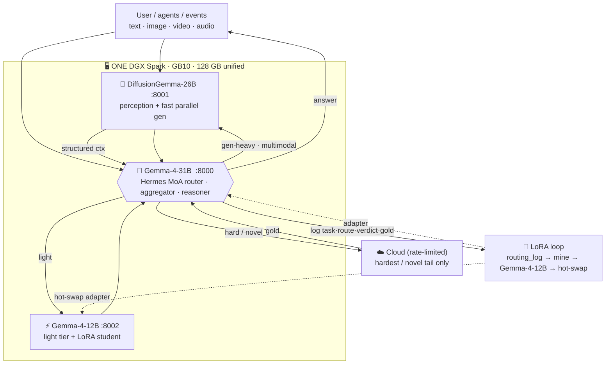
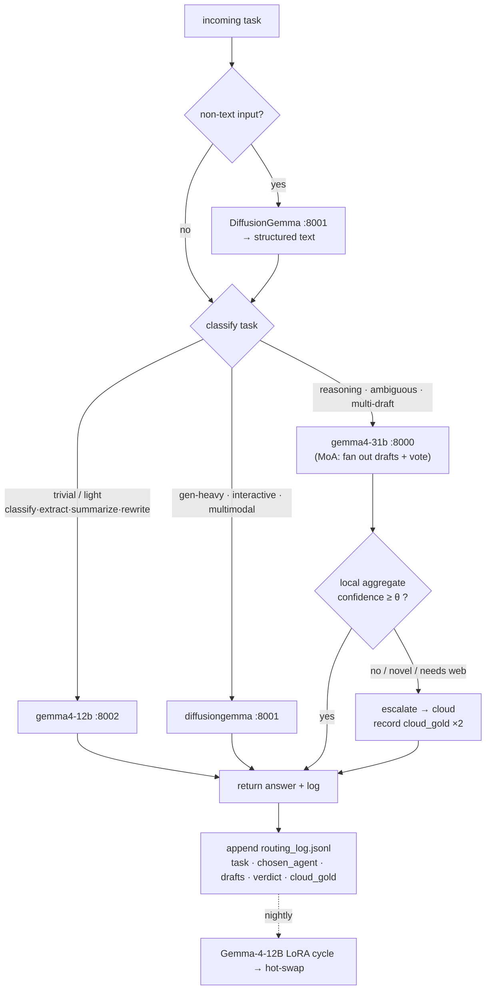

# Single-Spark build: the same self-improving MoA on **1 DGX Spark**

The main stack spreads six roles across four DGX Sparks. You don't need four. This recipe
collapses the **entire routing + self-improvement loop onto one GB10 (128 GB unified)** using
small NVFP4 models that co-reside on a single GPU. The **routing logic and the LoRA loop are
byte-for-byte the same** — only the endpoints change (four node IPs → four localhost ports).

> **Who this is for:** one DGX Spark / GB10 (128 GB unified, sm_121a). ~90 GB of models +
> KV fit with room to spare. You lose nothing in *logic*; you trade peak reasoning quality and
> gen-heavy throughput for a single box.

---

## 1. The one-Spark roster

The trick is an **all-Gemma-4 family** stack: every model shares a tokenizer and format, so the
mined training data is reusable across all of them, and behavior stays consistent.

| Role | Model | Quant | ~Weights | Endpoint |
|---|---|---|---|---|
| **Brain** — router · aggregator · reasoner | **Gemma-4-31B-it** (dense) | NVFP4 | ~16 GB | `localhost:8000` |
| **Fast gen · interactive · perception** | **DiffusionGemma-26B** (MoE, ~3.8B active, multimodal) | NVFP4 | ~13 GB | `localhost:8001` |
| **Light tier + LoRA student/trainer** | **Gemma-4-12B** | NVFP4 serve / bf16 train | ~6 GB serve | `localhost:8002` |
| **Escalation only** — hard/novel tail | Cloud (Claude / Codex / Grok) | API | — | provider |

**Why these:** Gemma-4-31B is a real reasoner (≳ a 27B) so the hard tail stays *local* — this is
what keeps cloud reliance falling. DiffusionGemma denoises 256-token blocks in parallel (~4×
faster than AR; MoE → escapes the GB10 ~273 GB/s decode wall) and is multimodal, so it doubles as
perception. Gemma-4-12B is small enough to LoRA-train on-box. See
[the model-choice reasoning](../README.md#4-why-these-models-design-reasoning).

**Brain substitution:** if you can't get Gemma-4-31B, use **Qwen3.6-27B-NVFP4** as the brain
(proven in this repo). You keep the strong head; you lose only the same-family training-data reuse
(Qwen's tokenizer differs from Gemma's — you'd train Gemma adapters from Gemma-tokenized data and
route with Qwen).

### Architecture — one box, four roles



---

## 2. Fit math (why it's comfortable, not tight)

On 121.7 GiB usable, at aggregate `gpu-memory-utilization` **0.85** → ~103 GiB for models+KV,
~18 GiB for the host (GB10 resident ~9–13 GiB, fine):

```
weights:  Gemma-4-31B 16  +  DiffusionGemma 13  +  Gemma-4-12B 6   =  ~35 GiB
free for KV pools:                                                   ~68 GiB
```

You are **not memory-bound** — 0.85 is generous; ~0.5 also fits. **Two rules that matter more
than capacity:**

- **`0.85` is the AGGREGATE, not per-instance.** Three vLLM servers each at 0.85 collide (each
  grabs 103 GiB). Give each server a slice: run all three at `--gpu-memory-utilization 0.28`
  (sum ≈ 0.84) **or** pass each an explicit `--kv-cache-memory-bytes`.
- **LoRA training is *extra*, outside the vLLM budget.** A Gemma-4-12B LoRA burst is ~38 GiB of
  its own (bf16 weights + optimizer/grads). Don't serve-all-three-at-0.85 *and* train at the same
  time — **time-slice**: nightly, drop the light serve and train, then hot-swap the adapter back.

---

## 3. Build & serve

### a. Prereqs
- DGX Spark, DGX OS ≥ 7.5, CUDA 13 in PATH (NVFP4 kernels need CUDA ≥ 12.9 on GB10).
- A vLLM build that serves NVFP4 on sm_121a. The `aeon-vllm-a4q:port` image used elsewhere in
  this repo works; any vLLM ≥ 0.24 with the modelopt NVFP4 path + sm_121a kernels will do.

### b. Get the models
```bash
hf download google/gemma-4-31b-it            --local-dir ~/models/gemma4-31b-it
hf download google/diffusiongemma-26b        --local-dir ~/models/diffusiongemma-26b
hf download google/gemma-4-12b-it            --local-dir ~/models/gemma4-12b-it
# NVFP4-quantize the two servers (nvidia modelopt / llm-compressor) if no NVFP4 build exists:
#   modelopt PTQ → NVFP4, or grab a community NVFP4 checkpoint.
```

### c. Serve all three, co-resident (util split so the sum ≤ 0.85)
```bash
# Brain (:8000) — the reasoner/aggregator
docker run -d --name brain --gpus all --network host --ipc host \
  -v ~/models/gemma4-31b-it:/model:ro --entrypoint vllm <nvfp4-image> \
  serve /model --served-model-name gemma4-31b --quantization modelopt \
    --kv-cache-dtype nvfp4 --gpu-memory-utilization 0.28 --max-model-len 65536 --port 8000

# Fast gen / perception (:8001) — DiffusionGemma
docker run -d --name gen --gpus all --network host --ipc host \
  -v ~/models/diffusiongemma-26b:/model:ro --entrypoint vllm <nvfp4-image> \
  serve /model --served-model-name diffusiongemma --trust-remote-code \
    --quantization modelopt --gpu-memory-utilization 0.28 --port 8001

# Light tier (:8002) — Gemma-4-12B (NVFP4 for serving)
docker run -d --name light --gpus all --network host --ipc host \
  -v ~/models/gemma4-12b-it:/model:ro --entrypoint vllm <nvfp4-image> \
  serve /model --served-model-name gemma4-12b --quantization modelopt \
    --kv-cache-dtype nvfp4 --gpu-memory-utilization 0.25 --max-model-len 65536 --port 8002
```
Tune the three `--gpu-memory-utilization` values so their **sum ≤ 0.85** (leave host headroom).
Prefer explicit `--kv-cache-memory-bytes` if you want deterministic long-context allocation.

---

## 4. The routing logic — identical, just re-pointed

The MoA policy is **unchanged** from the 4-Spark [`router/moa-config.md`](../router/moa-config.md).
Only the endpoint table changes (localhost ports instead of node IPs):

```
Reference models (draft): gemma4-12b @ :8002  (light)
                          diffusiongemma @ :8001  (fast gen / perception)
Aggregator:               gemma4-31b @ :8000     (brain merges/votes)
Fallback / escalation:    cloud (codex / opus / grok)  — only on low local confidence
```

Apply with `hermes moa configure` (reference = 12b + diffusiongemma, aggregator = 31b), keep cloud
in `hermes fallback`. **Routing policy is the same cheapest-competent-agent rule:**
- trivial/light → gemma4-12b
- gen-heavy / interactive / multimodal → diffusiongemma
- reasoning / aggregation / ambiguous → gemma4-31b (also the MoA vote)
- genuinely hard/novel → escalate to cloud (budget-gated)
- target ≥90% local; escalate only the most informative tail.

Everything in [`router/HOOK_SETUP.md`](../router/HOOK_SETUP.md) (the `routing_log.jsonl` hook)
works unchanged — it logs per-LLM-call regardless of node count.

### Routing decision logic (what Hermes evaluates per task)



### Hermes-consumable MoA activation plan

Drop this into Hermes' context (or `router/moa-plan.single-spark.json`) so the agent can
**activate the MoA directly** — it maps 1:1 to `hermes moa configure` + `hermes fallback`:

```json
{
  "moa_plan": "single-spark",
  "node": "localhost",
  "aggregator": { "id": "gemma4-31b", "endpoint": "http://localhost:8000/v1" },
  "reference_models": [
    { "id": "gemma4-12b", "endpoint": "http://localhost:8002/v1",
      "competence": ["light","classify","extract","summarize","rewrite","short_chat"], "cost": 1 },
    { "id": "diffusiongemma", "endpoint": "http://localhost:8001/v1",
      "competence": ["gen_heavy","interactive","perception","multimodal"], "cost": 1 }
  ],
  "fallback": [
    { "id": "cloud", "providers": ["openai-codex:gpt-5.5","openrouter:anthropic/claude-opus-4.8","grok"],
      "cost": 100, "use": "hard_or_novel_only" }
  ],
  "routing": {
    "perception_first": true,
    "rule": "cheapest_competent_agent",
    "escalation_gate": { "metric": "aggregate_confidence", "threshold": 0.6, "on_fail": "fallback" },
    "target_local_share": 0.9
  },
  "self_improvement": {
    "log": "~/.hermes/routing_log.jsonl",
    "student": "gemma4-12b",
    "cycle": "~/keys-setup-stack/train/run-lora-cycle.sh",
    "cloud_gold_weight": 2.0,
    "trigger": "nightly OR >=50 new pairs"
  }
}
```

**How Hermes activates it:** reference models = `gemma4-12b` + `diffusiongemma`, aggregator =
`gemma4-31b` (`hermes moa configure`); cloud stays in `hermes fallback`; the escalation gate fires
cloud only when local aggregate confidence < 0.6. Same rule set as the 4-Spark plan — only the
endpoints and model ids differ.

---

## 5. The self-improvement loop — unchanged

Identical to [`train/lora-loop.md`](../train/lora-loop.md):
`routing_log.jsonl → mine_signal.py → Gemma-4-12B LoRA → eval-gate → hot-swap`.

One-box specifics:
- **Gemma-4-12B is the student** (same as 4-Spark). Train it in a **nightly window** — stop the
  `light` serve, run `train/run-lora-cycle.sh`, hot-swap the adapter, restart the serve.
- **Same-family bonus:** because brain/gen/light are all Gemma-4, the *mined data* trains adapters
  for each. (Adapters are size-specific — a 12B adapter doesn't load into the 31B — but the
  **data corpus is shared**, so you can train a 31B routing adapter and a 12B light adapter from
  the exact same pairs. If the brain is Qwen instead, you lose this reuse.)
- Weight cloud-gold pairs 2× so each escalation that *does* happen buys a permanent local skill.

---

## 6. Honest tradeoffs vs the 4-Spark stack

| | 4-Spark | 1-Spark |
|---|---|---|
| Routing logic | same | **same** |
| LoRA loop | same | **same** (time-sliced training) |
| Peak reasoning | DSV4F MoE brain | Gemma-4-31B dense (strong, ~17 tok/s decode) |
| Gen-heavy throughput | dedicated TwoTower | DiffusionGemma (fine, shared GPU) |
| Concurrency headroom | large | modest (shared KV) |
| Cloud reliance | lowest | slightly higher on the hardest tail |
| Boxes / power / cost | 4 | **1** |

The one real quality gap: a single box can't hold a frontier-class MoE brain *and* everything else,
so the very hardest/most-novel tasks lean on cloud a bit more — but the LoRA flywheel still drives
that share down over time. For a personal self-improving assistant, **1 Spark is the sweet spot**.
```
```
